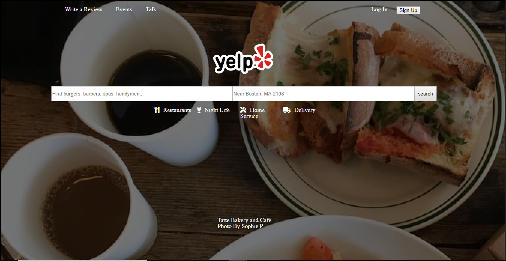

# My Awesome Yelp
Yelp's home page has been recreated and made responsive using HTML and CSS.

## How It's Made:

**Tech used:** HTML, CSS

In the project I mimicked the original Yelp homepage to the best of my abilities. I chose and placed content using HTML, and rearranged the content and styled using CSS.

## Lessons Learned:

During the construction of this webpage, I learned the importance of color contrast when styling with CSS, as a large portion of this site is positioned in front of a background image.
